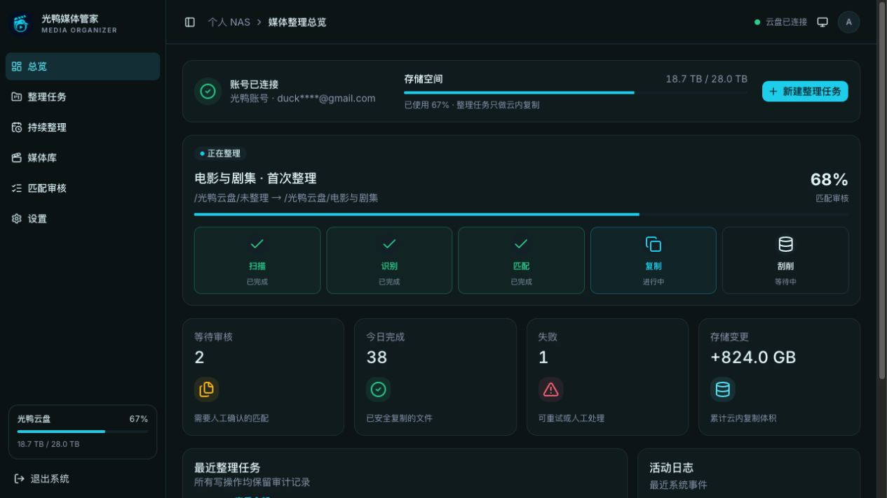

<p align="center">
  
</p>

<h1 align="center">光鸭媒体管家</h1>

<p align="center">
  整理光鸭云盘中的电影和电视剧，生成适用于 Plex、Jellyfin 的目录、海报与 NFO。
</p>

<p align="center">
  
</p>

> 光鸭云盘没有公开且稳定的开发者 API。本项目通过第三方 `guangyapan` 接入，接口变化可能导致登录或文件操作失效。

## 功能

- 扫码登录光鸭云盘，自动续期并加密保存凭证。
- 按目录识别电影、电视剧、季、集、字幕和附加内容。
- 使用 TMDB 匹配元数据；无法确定时可人工搜索、修改或忽略。
- 可选使用兼容 OpenAI API 的模型辅助识别，结果需要人工确认。
- 批量审核后在云盘内复制、重命名并上传海报和 NFO。
- 任务进度、失败原因、整理结果和媒体库统一在 Web 页面查看。

源目录不会被移动、重命名或删除。整理结果先写入目标目录中的 `_整理中`，完成后再移入正式目录。

## 部署

需要 Docker 和 Docker Compose v2。

```bash
cp .env.example .env
docker compose up -d
```

Compose 会从 GitHub Container Registry 拉取应用镜像。启动完成后访问：

- 本机：<http://127.0.0.1:4173>
- NAS 局域网：将 `.env` 中的 `BIND_HOST` 和 `WEB_ORIGIN` 改为 NAS 的内网地址

例如：

```dotenv
BIND_HOST=192.168.1.10
WEB_ORIGIN=http://192.168.1.10:4173
```

API 只在 Compose 内部网络开放，由 Web 服务代理。

### 连接真实云盘

首次启动默认使用演示模式。连接真实账号前，至少修改：

```dotenv
DEMO_MODE=false
ADMIN_PASSWORD=替换为至少12位的密码
SESSION_SECRET=替换为至少32位的随机字符串
TMDB_API_TOKEN=你的TMDB凭证
```

`TMDB_API_TOKEN` 支持 TMDB v3 API Key 和 v4 Read Access Token。AI 识别不是必需功能；需要时再填写：

```dotenv
AI_BASE_URL=https://api.openai.com/v1
AI_API_KEY=你的API密钥
AI_MODEL=gpt-4.1-mini
```

`TOKEN_ENCRYPTION_KEY` 可以留空，系统会从 `SESSION_SECRET` 派生加密密钥。

### TMDB 代理

NAS 无法直接访问 TMDB 时，可使用宿主机代理：

```dotenv
TMDB_PROXY_URL=http://host.docker.internal:7890
```

修改后重启 API 和 Worker：

```bash
docker compose restart api worker
```

不要在容器配置中使用 `127.0.0.1:7890`，该地址指向容器自身。

### 更新和维护

```bash
# 查看状态
docker compose ps

# 查看日志
docker compose logs -f

# 拉取并启动新镜像
docker compose pull
docker compose up -d

# 停止服务，保留数据库和 Redis 数据
docker compose down
```

`IMAGE_TAG` 默认为 `latest`。需要固定版本时，在 `.env` 中设置发布标签：

```dotenv
IMAGE_TAG=v0.1.3
```

应用启动时会自动执行数据库迁移。

## 本地开发

从源码构建全部容器：

```bash
docker compose -f docker-compose.yml -f docker-compose.build.yml up --build
```

分别启动后端和前端：

```bash
cd backend
python -m venv .venv
source .venv/bin/activate
pip install -e ".[dev]"
DEMO_MODE=true DATABASE_URL=sqlite+aiosqlite:///./media_manager.db uvicorn app.main:app --reload
```

```bash
cd web
npm install
npm run dev
```

## 测试

```bash
cd backend
.venv/bin/ruff check app tests
.venv/bin/mypy app
.venv/bin/pytest -q
```

```bash
cd web
npm run lint
npm test
npm run build
```

```bash
python3 scripts/check-secrets.py
```

## 安全说明

- 默认只监听 `127.0.0.1`；开放到局域网前请设置管理员密码。
- 非演示模式拒绝默认密码和过短的会话密钥。
- 同名但内容不同的目标文件不会被覆盖。
- 失败或取消的任务不会自动删除暂存文件。
- 云盘凭证、TMDB 凭证和 AI 密钥不会在前端接口中回显。
- AI 只接收文件名和目录信息，不会上传媒体文件。
